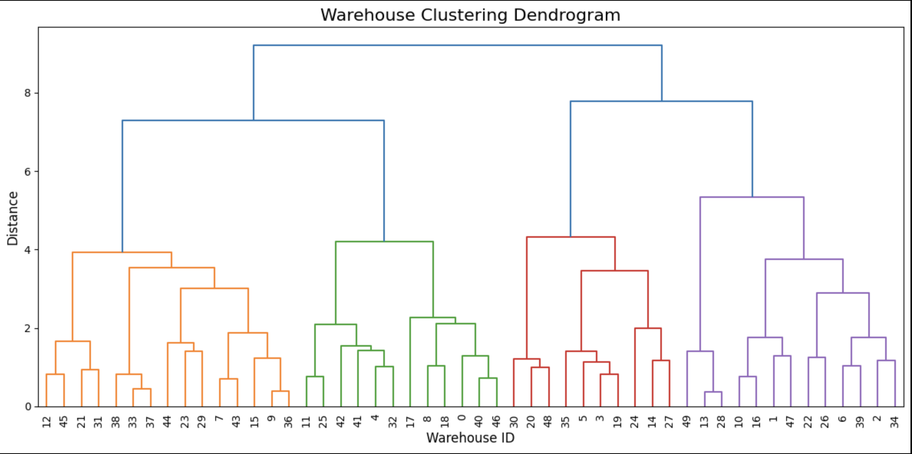
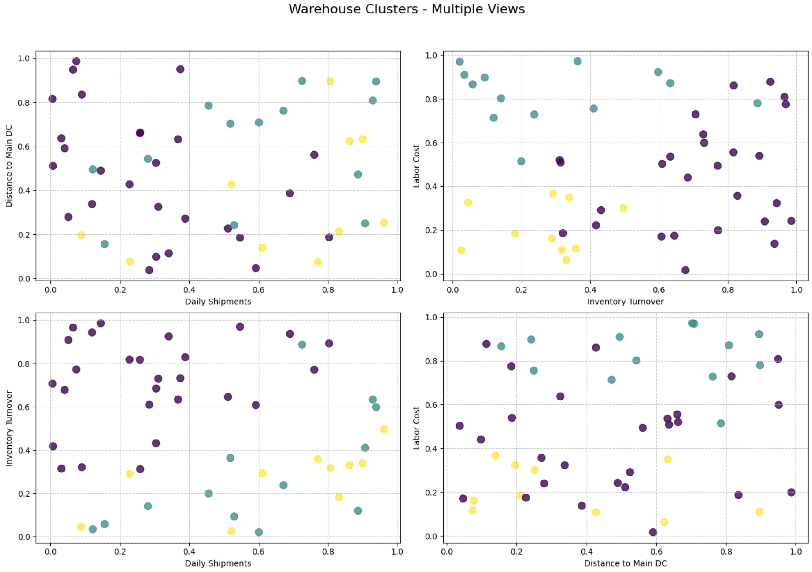

# Clustering Warehouses
Cluster warehouses by daily shipments, distance to distribution center, inventory turnover, and labor cost.

    import numpy as np
    import pandas as pd
    from sklearn.cluster import AgglomerativeClustering
    from scipy.cluster.hierarchy import dendrogram, linkage
    import matplotlib.pyplot as plt
    from sklearn.preprocessing import StandardScaler
    
    #1. DATA CREATION
    np.random.seed(42)  # For reproducibility
    warehouse_data = np.random.rand(50, 4)
    df = pd.DataFrame(warehouse_data, 
                      columns=['daily_shipments','dist_main_dc','inventory_turnover','labor_cost'])
    
    #1b. SCALE THE DATA (recommended for clustering)
    scaler = StandardScaler()
    df_scaled = scaler.fit_transform(df)
    df_scaled_df = pd.DataFrame(df_scaled, columns=df.columns)
    
    #2. HIERARCHICAL CLUSTERING
    #The correct parameter is 'metric' instead of 'affinity' in newer scikit-learn versions
    clustering_model = AgglomerativeClustering(n_clusters=3, metric='euclidean', linkage='ward')
    labels = clustering_model.fit_predict(df_scaled)  # Using scaled data
    df['cluster_label'] = labels
    
    print("First 10 warehouses with cluster labels:")
    print(df.head(10))
    
    First 10 warehouses with cluster labels:
       daily_shipments  dist_main_dc  inventory_turnover  labor_cost  \
    0         0.374540      0.950714            0.731994    0.598658   
    1         0.156019      0.155995            0.058084    0.866176   
    2         0.601115      0.708073            0.020584    0.969910   
    3         0.832443      0.212339            0.181825    0.183405   
    4         0.304242      0.524756            0.431945    0.291229   
    5         0.611853      0.139494            0.292145    0.366362   
    6         0.456070      0.785176            0.199674    0.514234   
    7         0.592415      0.046450            0.607545    0.170524   
    8         0.065052      0.948886            0.965632    0.808397   
    9         0.304614      0.097672            0.684233    0.440152   
    
    cluster_label  
    0              0  
    1              1  
    2              1  
    3              2  
    4              0  
    5              2  
    6              1  
    7              0  
    8              0  
    9              0  
    
    #3. DENDROGRAM VISUALIZATION
    Z = linkage(df_scaled, method='ward')  # Using scaled data
    
    plt.figure(figsize=(12, 6))
    plt.title("Warehouse Clustering Dendrogram", fontsize=16)
    plt.xlabel("Warehouse ID", fontsize=12)
    plt.ylabel("Distance", fontsize=12)
    
    #Plot with improved appearance
    dendrogram(
        Z,
        leaf_rotation=90.,  # Rotates the labels to be more readable
        leaf_font_size=10.,  # Increases font size for better visibility
        color_threshold=0.7*max(Z[:,2]),  # Adjusts where the coloring threshold is
    )
    plt.tight_layout()
    plt.savefig('warehouse_dendrogram.png')  # Save the figure
    plt.show()
    
    
    
    #4. SCATTER PLOT OF CLUSTERS - With Multiple Views
    fig, axs = plt.subplots(2, 2, figsize=(14, 10))
    fig.suptitle('Warehouse Clusters - Multiple Views', fontsize=16)
    
    #Plot 1: Daily Shipments vs Distance to Main DC
    axs[0, 0].scatter(df['daily_shipments'], df['dist_main_dc'], c=df['cluster_label'], cmap='viridis', s=80, alpha=0.8)
    axs[0, 0].set_xlabel('Daily Shipments')
    axs[0, 0].set_ylabel('Distance to Main DC')
    axs[0, 0].grid(True, linestyle='--', alpha=0.7)
    
    #Plot 2: Inventory Turnover vs Labor Cost
    axs[0, 1].scatter(df['inventory_turnover'], df['labor_cost'], c=df['cluster_label'], cmap='viridis', s=80, alpha=0.8)
    axs[0, 1].set_xlabel('Inventory Turnover')
    axs[0, 1].set_ylabel('Labor Cost')
    axs[0, 1].grid(True, linestyle='--', alpha=0.7)
    
    #Plot 3: Daily Shipments vs Inventory Turnover
    axs[1, 0].scatter(df['daily_shipments'], df['inventory_turnover'], c=df['cluster_label'], cmap='viridis', s=80, alpha=0.8)
    axs[1, 0].set_xlabel('Daily Shipments')
    axs[1, 0].set_ylabel('Inventory Turnover')
    axs[1, 0].grid(True, linestyle='--', alpha=0.7)
    
    #Plot 4: Distance to Main DC vs Labor Cost
    axs[1, 1].scatter(df['dist_main_dc'], df['labor_cost'], c=df['cluster_label'], cmap='viridis', s=80, alpha=0.8)
    axs[1, 1].set_xlabel('Distance to Main DC')
    axs[1, 1].set_ylabel('Labor Cost')
    axs[1, 1].grid(True, linestyle='--', alpha=0.7)
    
    plt.tight_layout()
    plt.subplots_adjust(top=0.9)  # Adjust for the suptitle
    plt.savefig('warehouse_clusters.png')  # Save the figure
    plt.show()
    
  
    
    #5. CLUSTER ANALYSIS
    print("\nCluster Analysis:")
    cluster_analysis = df.groupby('cluster_label').mean()
    print(cluster_analysis)
    
    Cluster Analysis:
                   daily_shipments  dist_main_dc  inventory_turnover  labor_cost
    cluster_label                                                               
    0                     0.294771      0.471283            0.716870    0.442280
    1                     0.594360      0.593475            0.292030    0.823158
    2                     0.658900      0.353065            0.267801    0.208378
    
    Cluster Variances:
                   daily_shipments  dist_main_dc  inventory_turnover  labor_cost
    cluster_label                                                               
    0                     0.054554      0.081251            0.043827    0.058466
    1                     0.081778      0.064972            0.073478    0.016156
    2                     0.087565      0.078477            0.021022    0.013241
    
    Results exported to 'warehouse_clusters_results.csv'
    
    #Add variance analysis to see within-cluster dispersion
    print("\nCluster Variances:")
    cluster_variance = df.groupby('cluster_label').var()
    print(cluster_variance)
    
    #6. EXPORT RESULTS
    df.to_csv('warehouse_clusters_results.csv', index=False)
    print("\nResults exported to 'warehouse_clusters_results.csv'")
